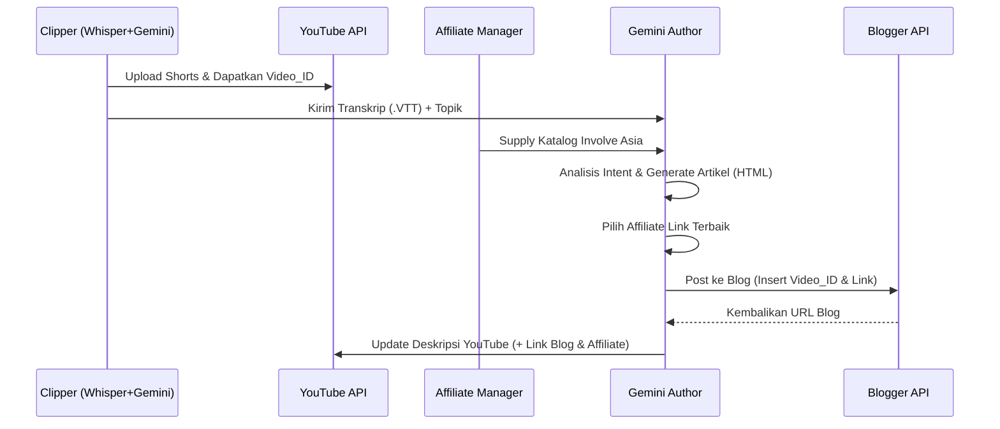

# Blueprint Arsitektur: KnowClips "Ultimate Passive Income" Machine

Dokumen ini adalah cetak biru (blueprint) teknis untuk mengekspansi skrip **KnowClips** saat ini menjadi ekosistem *Digital Marketing* otonom. Dokumen ini sangat cocok digunakan sebagai bahan diskusi arsitektur dengan *Engineer* atau AI lain.

## 1. Konsep Utama (The Synergy)
Menggabungkan 3 pilar utama menjadi satu *Pipeline* otomatis:
1. **YouTube Shorts:** Mesin *Traffic* Algoritmik (Volume tinggi, retensi pendek).
2. **Google Blogger (Blogspot):** Mesin *Traffic* SEO (Volume stabil, *intent* pencarian kuat, mendukung AdSense).
3. **Involve Asia:** Mesin Monetisasi (Konversi tinggi berbasis *Search Intent*).

---

## 2. Arsitektur Modul Tambahan (New Python Modules)

### A. Modul: `affiliate_manager.py` (Katalog Involve Asia)
Modul ini bertugas menyimpan dan mengelola daftar *link affiliate*.
- **Data Source:** Sebuah file lokal (misal: `affiliate_catalog.yaml`) yang berisi daftar produk unggulan pengguna.
- **Struktur Data:**
  ```yaml
  affiliates:
    - id: "tech_01"
      keyword_tags: ["laptop", "gadget", "komputer", "elektronik"]
      url: "https://invol.co/aff_link_1"
      cta_text: "Cek Harga Laptop Gaming Murah di Sini"
    - id: "generic_01"
      keyword_tags: ["promo", "diskon", "gratis ongkir"]
      url: "https://invol.co/aff_link_2"
      cta_text: "Klaim Voucher Gratis Ongkir Tokopedia Hari Ini"
  ```

### B. Modul: `gemini_author.py` (AI Blogger & Matchmaker)
Berbeda dengan pemotong video, *Prompt* Gemini di sini difokuskan pada NLP (*Natural Language Processing*) untuk SEO.
- **Input:** Transkrip Whisper (`.vtt`) dari klip video + Metadata Video + Daftar `affiliate_catalog.yaml`.
- **Logic Pemasangan Affiliate (3 Mode):**
  1. **Creative Match:** Jika topik VTT cocok dengan `keyword_tags` (misal video bahas sejarah -> cari link buku).
  2. **Generic Fallback:** Jika video *random* (lawakan), AI mengambil `id: generic_01` (Diskon E-commerce).
  3. **Strict Mode (Threshold):** Batal memasang link jika tidak ada relevansi > 70%.
- **Output (Format JSON):**
  ```json
  {
    "seo_title": "Rahasia Sejarah yang Tidak Diajarkan di Sekolah",
    "article_html": "<p>Pembukaan...</p> <!-- YouTube Embed Placeholder --> <p>Pembahasan VTT...</p>",
    "selected_affiliate_cta": "<a href='https://invol.co/aff_link_1'>Beli Buku Sejarah Lengkap Disini</a>",
    "image_prompt": "Ilustrasi buku sejarah kuno yang misterius"
  }
  ```

### C. Modul: `blogger_uploader.py` (API Google Blogger)
- **Otentikasi:** Menggunakan `google-api-python-client` (berbagi file `token.json` dengan YouTube API, namun membutuhkan penambahan *Scopes* `https://www.googleapis.com/auth/blogger`).
- **Tugas Utama:**
  1. Melakukan *request* untuk mem-posting artikel baru.
  2. Mengganti `<!-- YouTube Embed Placeholder -->` dengan kode HTML `<iframe src="https://youtube.com/embed/{video_id}"></iframe>`.
  3. Menyisipkan struktur "Golden Template" (Gambar Utama + Embed + Artikel 500 kata + CTA Affiliate).

---

## 3. Data Flow Diagram (Alur Eksekusi Main.py)



## 4. Keuntungan SEO Sistem Ini (Dwell Time Hack)
Arsitektur ini didesain untuk memanipulasi *Time-On-Page* metrik Google secara legal. 
Ketika pengunjung mengklik artikel blog dari pencarian Google, mereka akan disuguhkan *embed* YouTube Shorts di paragraf kedua. Jika mereka memutar video (durasi 60 detik), mereka akan berdiam di halaman blog tersebut selama minimal 1 menit. Di mata algoritma Google, halaman dengan *Dwell Time* > 1 menit adalah halaman berkualitas tinggi (High-Quality Content), yang akan membuat artikel ini naik peringkat dengan sendirinya ke Halaman 1 Google.

## 5. Prasyarat (*Checklist* Sebelum Pembuatan Kode)
1. [ ] Pengguna harus mendaftar akun Blogger (`blogger.com`).
2. [ ] Pengguna harus masuk ke Google Cloud Console untuk mengaktifkan **Blogger API v3**.
3. [ ] Membuat skema `affiliate_catalog.yaml` dengan kumpulan link valid dari dashboard Involve Asia.
4. [ ] Memodifikasi `main.py` untuk menambahkan flag `--mode blog` atau menjalankannya otomatis setelah `--mode upload`.
